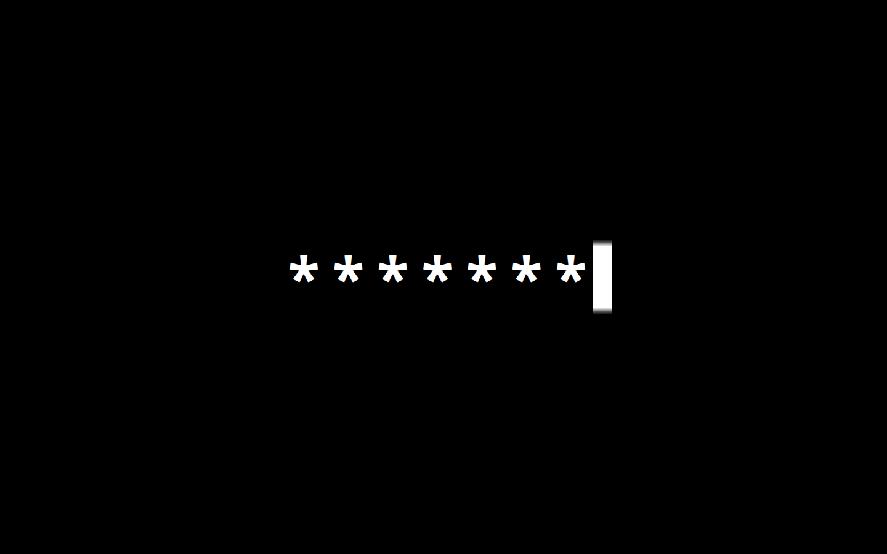
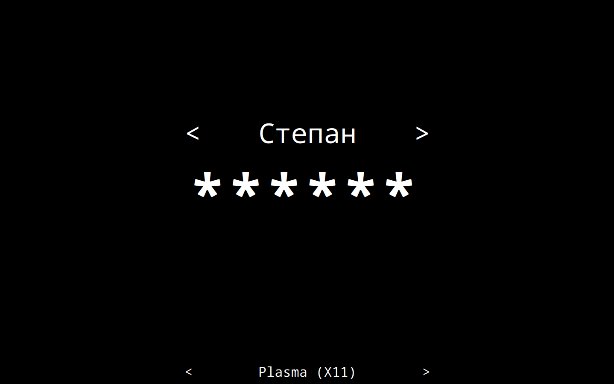
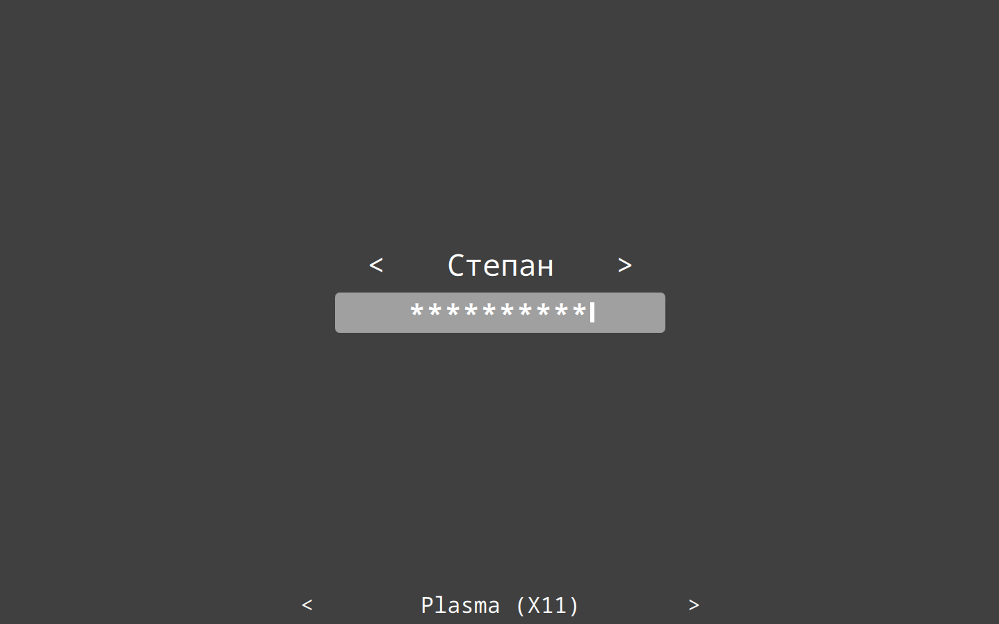
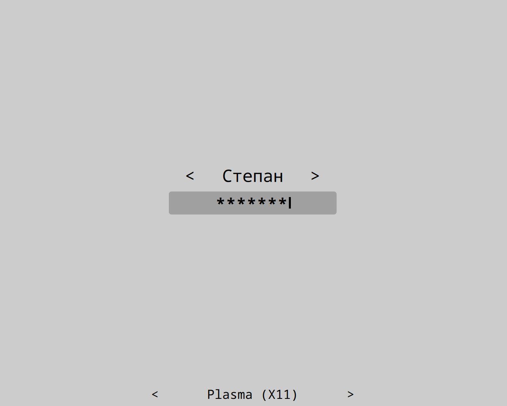
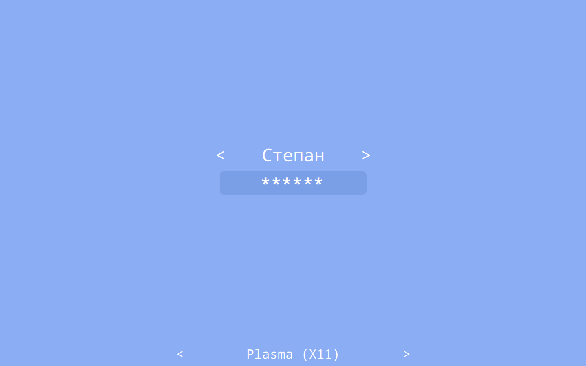
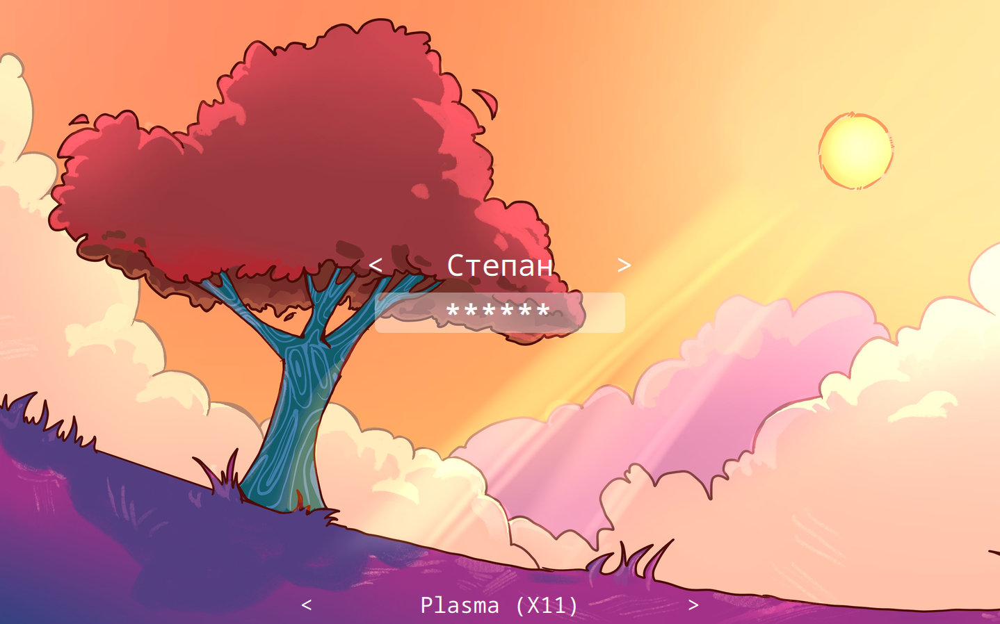

# Where is my SDDM theme?
*:eyes: That feeling when your SDDM theme suddenly disappeared...*

The *most minimalistic* and *highly customizable* SDDM theme. Only black screen and password input field. Nothing extra, right? Even when you enter wrong password theme will show only red border around your screen. To login, just type your password and press `<Enter>` key.

# Examples of customization
To install one of these configs, run inside theme directory:
```shell
cp <path to config> theme.conf
```
If config based on image background, also copy image. For example:
```shell
cp example_configurations/tree.conf theme.conf
cp example_configurations/tree.png tree.png
```
| | |
---|---
Classic (`where_is_my_sddm_theme/theme.conf`) | Classic, no cursor (`where_is_my_sddm_theme/example_configurations/classic_nocursor.conf`)
 | 
Grey (`where_is_my_sddm_theme/example_configurations/grey.conf`) | Light grey (`where_is_my_sddm_theme/example_configurations/lightgrey.conf`)
 | 
Blue (`where_is_my_sddm_theme/example_configurations/blue.conf`) |  Tree (`where_is_my_sddm_theme/example_configurations/tree.conf`)
 | 

If you have created an interesting configuration that might be useful to other people, please **share it via Pull Request!**

# Keymaps

`F2` or `Alt+u` - cycle select next user

`Ctrl+F2` or `Alt+Ctrl+u` - cycle select prev user

`F3` or `Alt+s` - cycle select next session

`Ctrl+F3` or `Alt+Ctrl+s` - cycle select prev session

`F10` - Suspend.

`F11` - Poweroff.

`F12` - Reboot.

`F1` - Show help message.

# Installation

## With script

This script installs latest theme version from **main branch**.

This script should be run with **super user privileges** (sudo)!

To install theme for Qt6, run `sudo ./install.sh`

To install theme for Qt5, run `USE_QT5=true sudo ./install.sh`

To install theme as current, run `sudo ./install.sh current`

## From KDE store
You can find product page on [pling](https://www.pling.com/p/2011322/)
### On KDE
1. Open System settings
2. Choose Start and finish/Log in (SDDM)
3. Click on "...", then "Download SDDM theme..."
4. Search "Where is my sddm theme?" theme
5. Install
6. Activate

### On other DEs/WMs
1. Open [link](https://www.pling.com/p/2011322/)
2. Click on "Install"
3. Unzip downloaded archive
4. Copy given folder to /usr/share/sddm/themes (`sudo cp -r where_is_my_sddm_theme/ /usr/share/sddm/themes`)
5. Open /etc/sddm.conf
6. Change line `Current=...` to `Current=where_is_my_sddm_theme`

## From source
1. Clone repo
2. [On other DEs/WMs](#on-other-deswms) (steps 4-6)

# Configuration
In `theme.conf` file you can find theme configuration.

Awailable settings:

`passwordcharacter=*` - Password mask character

`passwordMask=true` - Mask password characters or not ("true" or "false")

`passwordInputWidth=0.5` - value "1" is all display width, "0.5" is a half of display width etc.

`passwordInputBackground=` - Background color of password input

`passwordInputRadius=` - Radius of password input corners

`passwordInputCursorVisible=true` - "true" for visible cursor, "false"

`passwordFontSize=96` - Font size of password (in points)

`passwordCursorColor=random` - Color of password input cursor

`passwordTextColor=` - Color of password input text

`passwordAllowEmpty=false` - Allow blank password (e.g., if authentication is done by another PAM module)

`showSessionsByDefault=false` - Show or not sessions choose label

`sessionsFontSize=24` - Font size of sessions choose label (in points).

`showUsersByDefault=false` - Show or not users choose label

`showUserRealNameByDefault=true` - Show user real name on label by default

`usersFontSize=48` - Font size of users choose label (in points)

`background=` - Path to background image

`backgroundFill=#000000` - Or use just one color

`backgroundFillMode=aspect` - Qt fill mode for background image

`basicTextColor=#ffffff` - Default text color for all labels

`blurRadius=` - Radius for background blur. A larger radius increases the blur effect.

`hideCursor=` - Set to `true` to hide mouse cursor.

`cursorBlinkAnimation=true` - Enable or disable cursor blink animation ("true" or "false") **This option works only in Qt6**.


## Disable virtual keyboard

You can disable virtual keyboard by setting line `InputMethod=qtvirtualkeyboard`
to `InputMethod=` in sddm config file. SDDM config is located in `/etc/sddm.conf`
(or `/etc/sddm.conf.d/kde_settings.conf`)

# Contributions

Contributions are welcome! Create Issues and PRs

[](https://github.com/stepanzubkov/where-is-my-sddm-theme/stargazers)

[](https://github.com/stepanzubkov/where-is-my-sddm-theme/network/members)

# Support the development

You can support the development of this theme and other project by donating me [here](https://www.donationalerts.com/r/stepanzubkov) :heart:
